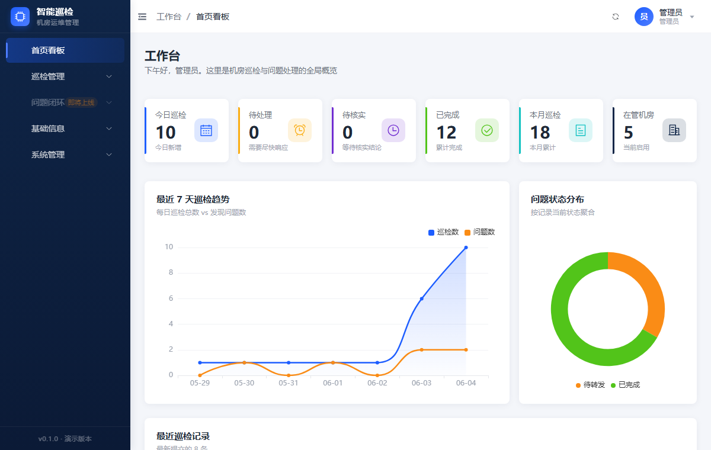
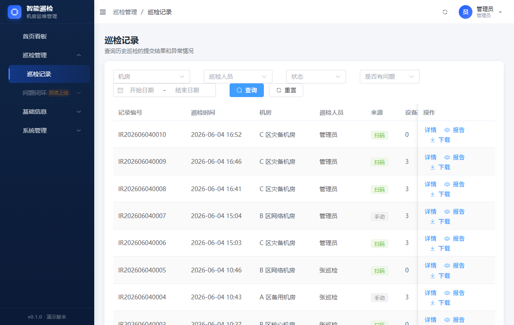
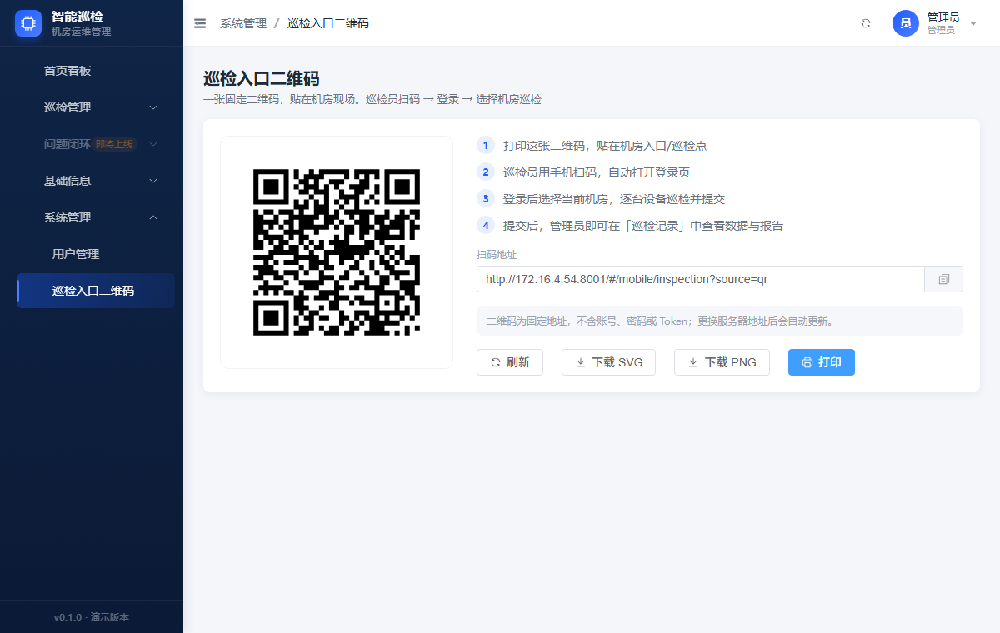
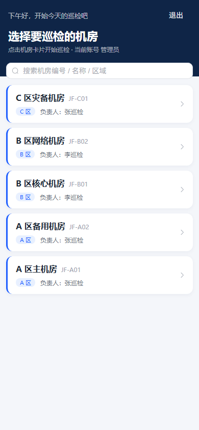
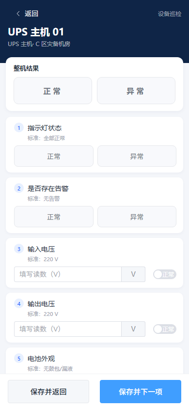
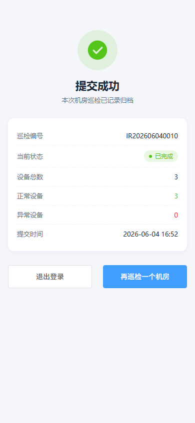

**中文** | [English](./README.en.md)

# 机房智能巡检与问题闭环管理系统

> Smart Data‑Center Inspection System — 手机扫码巡检 · 后台统一管理 · 自动生成巡检报告

一套面向机房/数据中心运维的巡检系统：**巡检员手机扫一张固定二维码即可登录巡检、逐台设备记录、提交后自动生成报告**；**管理员在 PC 后台统一查看记录、报告与统计看板**。前后端分离，开箱即用，支持 Docker 一键部署。

---

## 📸 界面截图

<table>
  <tr>
    <td align="center"><br/>后台看板</td>
    <td align="center"><br/>巡检记录</td>
    <td align="center"><br/>巡检入口二维码</td>
  </tr>
  <tr>
    <td align="center"><br/>手机·选择机房</td>
    <td align="center"><br/>手机·设备巡检</td>
    <td align="center"><br/>手机·提交成功</td>
  </tr>
</table>

---

## ✨ 功能特性

### 移动端（手机扫码，只负责巡检）
- 扫固定二维码 → 登录 → **选择机房** → 逐台设备巡检 → 提交
- 检查项支持**布尔（正常/异常）**、**数值（带单位与标准值）**、**文本** 三类
- 设备级异常标注 + **异常说明** + **现场拍照上传**
- 「保存并下一项」自动跳到下一台未巡检设备，断点可续
- 同一账号同一机房**每天仅可巡检一次**，已巡检机房在列表中标记「已巡检」
- 提交后可「再巡检一个机房」，全程为移动端优化的界面

### PC 后台（管理与查看）
- **首页看板**：今日/本月巡检、待处理/待核实、已完成等 KPI，7 天趋势图、状态分布饼图、最近记录
- **巡检记录**：多条件筛选（机房/巡检人/状态/是否异常/日期），详情含每台设备检查项、异常、照片与时间线
- **巡检报告**：每次提交自动生成**自包含 HTML 报告**（照片以 base64 内嵌，可离线查看），支持在线查看 / 下载 / 打印
- **机房 / 设备 / 用户管理**：基础信息维护，启用停用
- **巡检入口二维码**：生成一张固定二维码（SVG/PNG，可下载打印），贴在现场即可

### 问题闭环（异常 → 转发 → 处理 → 核实 → 归档）
- 巡检发现异常的记录自动进入闭环：**待转发 → 待处理 → 待核实 → 已完成**
- **管理员**转发给处理员（可填期望完成时间/说明）；**处理员**提交处理结果并上传整改照片；**核实员**核实通过或驳回（驳回填原因并退回处理员）
- 「问题闭环」菜单按状态分组（待转发 / 待处理 / 待核实 / 已完成），详情页按当前状态 + 登录角色显示对应操作按钮
- 全流程写审计记录，详情时间线完整呈现谁在何时做了什么

### 其他
- JWT 登录鉴权 + 角色权限（管理员 / 巡检员 / 处理员 / 核实员）
- 数据库迁移（Alembic）+ 首次启动幂等写入演示数据
- 操作日志记录关键动作

---

## 🆕 更新日志

**v1.2**
- 巡检防重复：同一账号同一机房**每天仅可巡检一次**，选择机房页对当天已完成的机房显示「已巡检」标记并禁止再次进入
- 防脏数据：误触进入机房但未做任何操作，不再在后台/看板产生「巡检中」空记录（自动忽略空草稿，并在下次开始巡检时清理）

**v1.1**
- 新增**问题闭环**：异常巡检的转发 / 处理 / 核实 / 驳回全流程 + 整改照片 + 流程时间线
- 移动端改为**固定二维码**入口：扫码 → 登录 → 选机房 → 巡检 → 提交（手机端只做巡检，不进后台）
- 新增**巡检报告**（自包含 HTML，可查看 / 下载 / 打印）与「巡检入口二维码」管理页
- Docker Compose 一键部署 + GitHub Actions（CI + 构建并推送镜像到 GHCR）

---

## 🧰 技术栈

| 层 | 技术 |
|---|---|
| 后端 | Python 3.12 · FastAPI · SQLAlchemy 2 · Alembic · SQLite · JWT · qrcode |
| 前端 | Vue 3 · TypeScript · Vite · Element Plus · Pinia · Vue Router · ECharts |
| 部署 | Docker · Docker Compose · Nginx（前端静态 + 反向代理） |

---

## 🌐 在线演示（Demo）

> 部署后请使用你自己的服务器地址访问。

- 访问地址：`http://<服务器IP>:8001/`
- 干净部署默认账号：

| 账号 | 角色 | 用途 |
|---|---|---|
| `admin` | 管理员 | 登录 PC 后台，查看记录/报告、管理机房设备用户、生成巡检二维码 |

开启 `SEED_DEMO_DATA=true` 时会额外创建演示账号（密码统一 `123456`）：

| 账号 | 角色 | 用途 |
|---|---|---|
| `inspector01` / `inspector02` | 巡检员 | 手机扫码巡检 |
| `handler01` / `handler02` | 处理员 | 问题闭环：处理异常、提交整改 |
| `verifier01` | 核实员 | 问题闭环：核实通过 / 驳回 |

> ⚠️ 演示账号仅供体验，正式部署请第一时间修改密码与 `JWT_SECRET`。

---

## 🚀 快速开始

### 方式一：Docker Compose（推荐）

```bash
git clone <your-repo-url> inspection
cd inspection

cp .env.example .env
# 编辑 .env：把 PUBLIC_WEB_BASE_URL 改成手机/浏览器能访问到的地址(服务器IP)，并设置 JWT_SECRET

docker compose up -d --build
```

访问 `http://<服务器IP>:8001`，用 `admin / 123456` 登录。数据持久化在宿主机 `./data`（数据库 / 上传照片 / 巡检报告）。

> 国内服务器若拉取基础镜像超时，请参考 [DEPLOY.md](./DEPLOY.md) 配置 Docker 镜像加速器。

### 方式二：本地开发

**后端**（默认 8000）：
```bash
cd backend
python -m venv .venv
.venv\Scripts\activate          # Windows；Linux/Mac: source .venv/bin/activate
pip install -r requirements.txt
cp .env.example .env            # 按需修改
python -m alembic upgrade head
uvicorn app.main:app --reload --host 0.0.0.0 --port 8000
```

**前端**（默认 8001）：
```bash
cd frontend
npm install
npm run dev
```

打开 `http://localhost:8001`，后端接口由 Vite 代理转发到 `:8000`。
Swagger 文档：`http://localhost:8000/docs`。

---

## 📱 手机扫码巡检怎么测

固定二维码在后台「**系统管理 → 巡检入口二维码**」生成。手机需与电脑/服务器在同一网络，且 `PUBLIC_WEB_BASE_URL` 配成手机可达的地址（不能是 `localhost`）。详细步骤见 [docs/mobile-qr-test.md](./docs/mobile-qr-test.md)。

---

## 🗂️ 项目结构

```
.
├── backend/                # FastAPI 后端
│   ├── app/
│   │   ├── api/v1/         # REST 接口
│   │   ├── models/         # ORM 模型
│   │   ├── schemas/        # Pydantic 出入参
│   │   ├── services/       # 业务逻辑（巡检/报告/看板等）
│   │   ├── crud/ core/ db/ middleware/ utils/
│   ├── alembic/            # 数据库迁移
│   ├── Dockerfile
│   └── requirements.txt
├── frontend/               # Vue3 前端
│   ├── src/
│   │   ├── views/          # 页面（dashboard / inspection / basic / system / mobile）
│   │   ├── api/ router/ stores/ components/ layout/
│   ├── Dockerfile
│   └── nginx.conf
├── docs/                   # 文档
├── docker-compose.yml
├── .env.example
└── DEPLOY.md               # 部署详解
```

---

## 💾 数据存放

| 内容 | 位置（Docker） | 说明 |
|---|---|---|
| 数据库 | `./data/inspection.db` | 用户/机房/设备/巡检记录/检查项结果/附件元数据（SQLite） |
| 现场照片 | `./data/uploads/` | 上传原图，按 年/月 归档 |
| 巡检报告 | `./data/reports/` | 每次提交自动生成的 HTML 报告，文件名即记录编号 |

备份 = 直接拷贝 `./data` 目录。

---

## 📦 部署

生产部署（Docker Compose、镜像加速、运维命令、故障排查）详见 **[DEPLOY.md](./DEPLOY.md)**。

---

## 📄 License

[MIT](./LICENSE)
